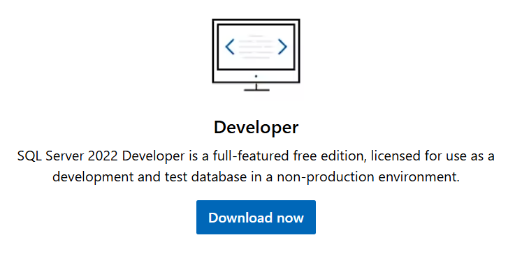
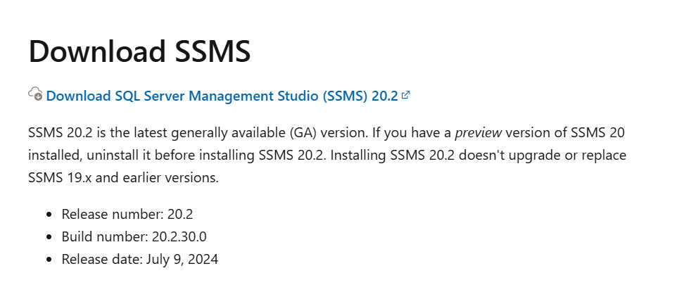
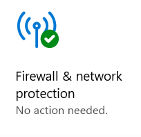
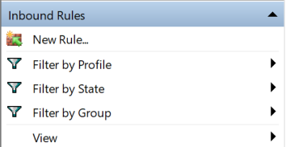
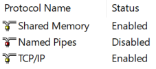
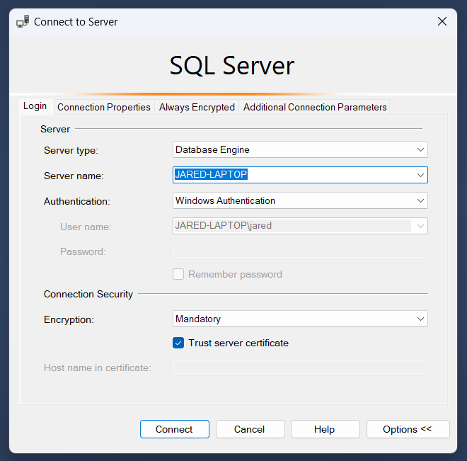
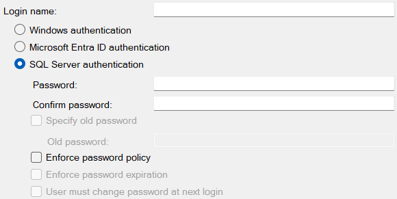
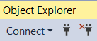
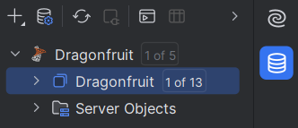
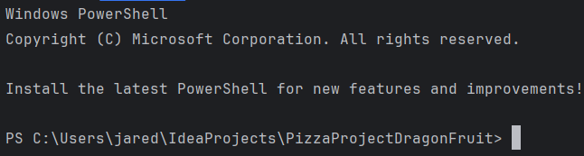

# PizzaProjectDragonFruit

**Disclaimer**
* Windows machine needed for these instructions

**Installation**
1. Install Node.js: https://nodejs.org/en/
2. Install Intellij IDEA Ultimate: https://www.jetbrains.com/idea/download/?section=windows
2. Install SQL Server Developer Edition: https://www.microsoft.com/en-us/sql-server/sql-server-downloads

3. Click on "Install SSMS" in the installation window
4. Scroll down and download SSMS (Link if you clicked out of the installation window) 
https://learn.microsoft.com/en-us/sql/ssms/download-sql-server-management-studio-ssms?view=sql-server-ver16

5. Leave everything on default settings

**Windows Security Firewall Change**
1. Click on Windows Security and open it
2. Go to "Firewall and Network Protection" and click on Advanced Settings at the bottom

3. Click "Yes" to allow Windows Security to make changes to device
4. Go to Inbound Rules and click on "New Rule" on the right side

5. Click on the Port option and click Next
6. Make sure TCP is checked, then click on "Specific local ports" and type in 1433 and click Next
7. Click on "Allow the connection" and click Next
8. Check all the options for where this rule applies then click Next
9. Type a name that this rule (Ex. SQL Server Port 1433) and click Finish
10. In the Inbound Rules list, look for the rule that you created
11. If it is on the list, close Windows Security

**SQL Configuration Manager**
1. Open SQL Server Configuration Manager 
2. Right-click on "SQL Server Network Configuration"
3. Click on "Protocols for MSSQLSERVER"
4. Click on "TCP/IP"

5. Change Enabled status to "Yes"
6. Close SQL Server Configuration Manager

**Using Microsoft SQL Server**
1. Open up SSMS as ADMIN and connect through Windows authentication

2. Check "Trust server certificate" and click Connect
3. Click on Security in the left menu
4. Right-click Logins and click New Login
5. Check "SQL Server authentication"
6. Enter a login name and password and confirm password 
7. Uncheck "Enforce password policy" then click OK 

8. Disconnect by clicking the plug with the red X (Pic) then reconnect with the regular plug 

9. Change to "SQL Server Authentication" and enter your login name and password 
10. Click on Security than Logins in the left menu 
11. Click on the username you made 
12. 2Under Server Roles, check public and sysadmin 
13. 13Under Status, grant permission to connect to the database and check "Enabled" for Login

**Making the Database in SQL Server**
1. Copy the code from DragonfruitDatabase.sql and paste it into a query
2. Execute it to generate the database

**Connecting Database to Intellij IDEA**
1. Click on the database icon in the taskbar on the right

2. Click the + symbol and choose Data Source then Microsoft SQL Server
3. Under Name, title the data source "Dragonfruit"
4. Type 1433 for Port
5. Change Authentication to "User & Password"
6. Put the username and password you choose in SSMS and change Save to "Forever"
7. Click Test connection to see if it connected
8. If it does, click Apply
9. Click on the database icon and expand Dragonfruit  

10. Next to the second Dragonfruit, click on the "# of 13" button and check dbo

**Running the Server**
1. In Intellij, open the command line

2. Run npm install
3. Run npm run dev
4. Visit http://localhost:3000/pages/home.html

**If Server Port 3000 Produces Error:**
Basically if you get an error that the port is already being used
1. CMD (Run as Admin)
2. netstat -ano | findstr :3000
3. taskkill /PID (Insert number that shows up) /F
4. npm run dev

**Login Instructions:**
One of the Defaults for Customer but you can create your own using "Create Your Account"
* Username: jane_smith
* Password: 9876543210